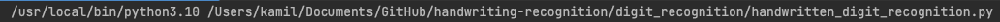
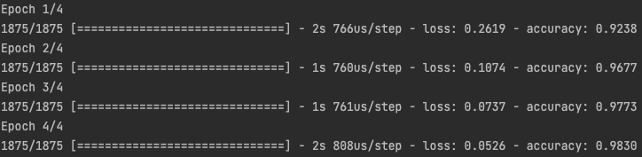

# Simple handwriting recognition

# NOTE
The solution is not bulletproof. 

Results also depend on the quality of data used to evaluate.

Use tensorflow-macos / tensorflow based on your OS.
If using mac you will also need to install certificates. To do it open terminal and run:

    
which should execute:
/Applications/Python/Install/Certificates.command

More on the issue:
https://stackoverflow.com/questions/41691327/ssl-sslerror-ssl-certificate-verify-failed-certificate-verify-failed-ssl-c/41692664

## Digit recognition

### Running the script
Run the digit_recognition/handwritten_digit_recognition.py file

### Training
Model will be trained depending on the amount of epochs its set for (default 4).

Increasing the number of epochs might lead to overfitting (memorisation of the set, which leads to inability to adapt).

Trained model will be saved to the digit_recognition/handwritten_digit_recognition folder.

### Evaluation
In digit_recognition/resources folder there are multiple "handwritten" (created in gimp)
pictures of handwritten digits (size 28px x 28px). Those will be used for testing.

#### Conclusion
All of my models seem to be struggling with digits > 5 (about 60-70% success rate).
1-5 seem to be recognised flawlessly almost every time.

Higher quality test images would most likely improve the accuracy.

